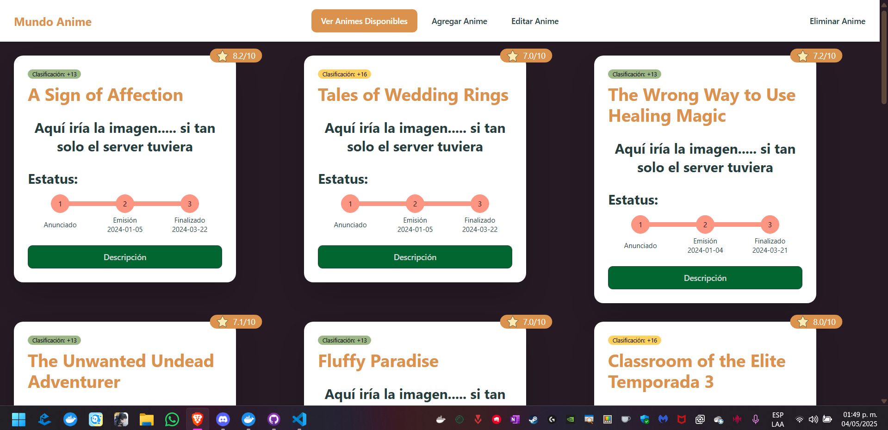

# Documentación del Proyecto MundoAnime con Docker

## Tabla de Contenidos

- [Documentación del Proyecto MundoAnime con Docker](#documentación-del-proyecto-mundoanime-con-docker)
  - [Tabla de Contenidos](#tabla-de-contenidos)
  - [Introducción](#introducción)
  - [Arquitectura Base del Proyecto](#arquitectura-base-del-proyecto)
  - [Estructura de Carpetas](#estructura-de-carpetas)
  - [Configuración Docker](#configuración-docker)
    - [Dockerfile Backend](#dockerfile-backend)
      - [Explicación detallada:](#explicación-detallada)
    - [Dockerfile Frontend](#dockerfile-frontend)
      - [Explicación detallada:](#explicación-detallada-1)
    - [Docker Compose](#docker-compose)
      - [Explicación detallada:](#explicación-detallada-2)
  - [Configuraciones Clave](#configuraciones-clave)
    - [Vite (Frontend)](#vite-frontend)
      - [Explicación:](#explicación)
    - [Nginx (Frontend)](#nginx-frontend)
      - [Explicación:](#explicación-1)
    - [CORS (Backend)](#cors-backend)
      - [Explicación:](#explicación-2)
  - [Guía de Despliegue](#guía-de-despliegue)
    - [Requisitos previos](#requisitos-previos)
    - [Pasos para el despliegue](#pasos-para-el-despliegue)
  - [Errores Comunes y Soluciones](#errores-comunes-y-soluciones)
    - [1. Conexión rechazada entre frontend y backend](#1-conexión-rechazada-entre-frontend-y-backend)
    - [2. PostgreSQL no se conecta](#2-postgresql-no-se-conecta)
  - [Comandos Útiles](#comandos-útiles)
  - [Consideraciones de Seguridad](#consideraciones-de-seguridad)

## Introducción

MundoAnime es una aplicación web fullstack que utiliza Docker para facilitar su despliegue y desarrollo. El proyecto está estructurado como una aplicación de tres niveles:

- **Frontend**: Aplicación desarrollada en Vite + React
- **Backend**: API REST desarrollada en NestJS
- **Base de datos**: PostgreSQL para almacenamiento persistente

## Arquitectura Base del Proyecto



El sistema sigue una arquitectura de microservicios dockerizada que consta de los siguientes elementos:

- **Cliente**: Accede a la aplicación a través del puerto 5000
- **Nginx**: Sirve archivos estáticos y actúa como proxy inverso
- **NestJS**: Procesa solicitudes de API y se comunica con la base de datos
- **PostgreSQL**: Almacena datos de manera persistente

Los servicios se comunican a través de una red Docker dedicada llamada `mundoanime-net`, proporcionando aislamiento y seguridad.

## Estructura de Carpetas

```
ROQUE-FINAL/
├── backend/
│   ├── dist/                  # Código compilado de NestJS
│   ├── postgres/              # Datos persistentes de PostgreSQL
│   ├── src/                   # Código fuente del backend
│   ├── test/                  # Pruebas del backend
│   ├── .dockerignore          # Archivos a ignorar en Docker
│   ├── .env                   # Variables de entorno
│   ├── Dockerfile             # Configuración Docker para backend
│   ├── package.json           # Dependencias del backend
│   └── wait-for-postgres.sh   # Script para esperar PostgreSQL
│
├── frontend/
│   ├── public/                # Assets públicos
│   ├── src/                   # Código fuente del frontend
│   ├── ssl/                   # Certificados SSL
│   ├── .dockerignore          # Archivos a ignorar en Docker
│   ├── Dockerfile             # Configuración Docker para frontend
│   ├── nginx.conf             # Configuración de Nginx
│   ├── package.json           # Dependencias del frontend
│   └── vite.config.js         # Configuración de Vite
│
└── docker-compose.yml         # Orquestación de contenedores
```

## Configuración Docker

### Dockerfile Backend

```dockerfile
# Etapa de construcción
FROM node:22-alpine AS builder

WORKDIR /app
COPY package*.json ./
COPY tsconfig*.json ./
RUN npm ci
COPY . .
RUN npm run build

# Etapa de ejecución
FROM node:22-alpine
WORKDIR /app

COPY --from=builder /app/package*.json ./
COPY --from=builder /app/node_modules ./node_modules
COPY --from=builder /app/dist ./dist

RUN apk add --no-cache postgresql-client

COPY wait-for-postgres.sh /wait-for-postgres.sh
RUN chmod +x /wait-for-postgres.sh

EXPOSE 3000

CMD ["/bin/sh", "-c", "/wait-for-postgres.sh db ${DB_PORT} ${DB_USERNAME} ${DB_NAME} && npm run start:prod"]
```

#### Explicación detallada:

1. **Multi-stage build**: 
   - Primera etapa (`builder`): Instala dependencias y compila el código TypeScript
   - Segunda etapa: Copia solo los archivos necesarios para producción

2. **Optimización de dependencias**:
   - Utiliza `npm ci` para garantizar instalaciones consistentes
   - Solo copia los `node_modules` necesarios para producción

3. **Cliente PostgreSQL**:
   - Instala `postgresql-client` para permitir que el script `wait-for-postgres.sh` se conecte a la base de datos

4. **Gestión de inicio**:
   - El script `wait-for-postgres.sh` asegura que la aplicación no inicie hasta que la base de datos esté lista
   - Utiliza variables de entorno para configuración dinámica

### Dockerfile Frontend

```dockerfile
# Etapa de construcción
FROM node:22-alpine as builder
WORKDIR /app
COPY package*.json ./
RUN npm ci
COPY . .
RUN npm run build

# Etapa de producción
FROM nginx:alpine
# Copiar archivos SSL
COPY ./ssl/mundoanime.crt /etc/nginx/ssl/
COPY ./ssl/mundoanime.key /etc/nginx/ssl/
# Configuración Nginx
COPY ./nginx.conf /etc/nginx/conf.d/default.conf
# Aplicación
COPY --from=builder /app/dist /usr/share/nginx/html/MundoAnime
EXPOSE 80 443
CMD ["nginx", "-g", "daemon off;"]
```

#### Explicación detallada:

1. **Multi-stage build**:
   - Primera etapa: Construye la aplicación con Node.js
   - Segunda etapa: Utiliza Nginx para servir archivos estáticos

2. **Optimización de caché**:
   - Copia primero los archivos de dependencias para aprovechar la caché de Docker
   - Solo construye cuando hay cambios en el código fuente

3. **Configuración Nginx**:
   - Montaje de la aplicación en `/MundoAnime` para rutas personalizadas
   - Archivo de configuración específico para SPAs
  
4. **Implementación de SSL**:
   - Se realizó la implementación de un certificado SSL a la pagina.

### Docker Compose

```yaml
version: '3.8'

services:
  db:
    image: postgres:14.4
    restart: always
    environment:
      POSTGRES_USER: ${DB_USERNAME:-postgres}
      POSTGRES_PASSWORD: ${DB_PASSWORD:-postgres}
      POSTGRES_DB: ${DB_NAME:-mundoanime}
    volumes:
      - ./backend/postgres:/var/lib/postgresql/data
    healthcheck:
      test: ["CMD-SHELL", "pg_isready -U ${DB_USERNAME:-postgres} -d ${DB_NAME:-mundoanime}"]
      interval: 5s
      timeout: 5s
      retries: 20
      start_period: 30s
    networks:
      - mundoanime-net

  backend:
    build:
      context: ./backend
      dockerfile: Dockerfile
    environment:
      DB_PORT: 5432
      DB_PASSWORD: ${DB_PASSWORD:-postgres}
    env_file:
      - .env
    ports:
      - "${BACKEND_PORT:-3000}:3000"
    depends_on:
      db:
        condition: service_healthy
    networks:
      - mundoanime-net
    restart: unless-stopped
  frontend:
    build:
      context: ./frontend
      dockerfile: Dockerfile
    env_file:
      - .env
    ports:
      - "${FRONTEND_PORT}:443"
    depends_on:
      - backend
    networks:
      - mundoanime-net

networks:
  mundoanime-net:
    driver: bridge
```

#### Explicación detallada:

1. **Servicio PostgreSQL**:
   - Utiliza versión específica (14.4) para consistencia
   - Configuración mediante variables de entorno con valores predeterminados
   - Verificación que garantiza disponibilidad antes de iniciar el backend
   - Persistencia de datos mediante volumen dedicado

2. **Servicio Backend**:
   - Construido desde el directorio local con Dockerfile
   - Variables de entorno cargadas desde archivo `.env`
   - Dependencia explícita de PostgreSQL con condición de salud

3. **Servicio Frontend**:
   - Puerto configurable con valor predeterminado 5000
   - Volumen para actualizar configuración de Nginx sin reconstruir la imagen
   - Dependencia del backend para garantizar orden de inicio correcto

4. **Red dedicada**:
   - Proporciona aislamiento de comunicación entre servicios
   - Utiliza driver `bridge` para compatibilidad general

## Configuraciones Clave

### Vite (Frontend)

```javascript
import { defineConfig } from "vite";
import tailwindcss from "@tailwindcss/vite";
import react from "@vitejs/plugin-react";

export default defineConfig({
  base: '/MundoAnime',
  plugins: [tailwindcss(), react()],
  server: {
    proxy: {
      '/api': {
        target: 'http://backend:3000',
        changeOrigin: true,
        rewrite: (path) => path.replace(/^\/api/, ''),
      },
    },
  },
});
```

#### Explicación:

- **Base path**: Configura la aplicación para servirse desde `/MundoAnime/`
- **Proxy API**: Redirige solicitudes `/api` al backend
- **Rewrite**: Remplaza las solicitudes que comienzan con el prefijo `/api` antes de enviar al backend

### Nginx (Frontend)

```nginx
server {
    listen 80;
    server_name localhost;
    
    return 301 https://$host:5001/MundoAnime;

    location = / {
        return 302 https://$host:5001/MundoAnime;
    }

    location = /MundoAnime {
        return 301 https://$host:5001/MundoAnime/;
    }
}

server {
    listen 443 ssl;
    server_name localhost;

    # Certificados SSL
    ssl_certificate /etc/nginx/ssl/mundoanime.crt;
    ssl_certificate_key /etc/nginx/ssl/mundoanime.key;
    
    # Configuración SSL
    ssl_protocols TLSv1.2 TLSv1.3;
    ssl_ciphers HIGH:!aNULL:!MD5;
    ssl_prefer_server_ciphers on;

    # Configuración para mantener rutas consistentes
    port_in_redirect on;
    absolute_redirect off;

    # Configuración principal de la aplicación
    location /MundoAnime {
        alias /usr/share/nginx/html/MundoAnime;
        try_files $uri $uri/ /MundoAnime/index.html;
        
        # Headers de caché y seguridad
        add_header Cache-Control "no-cache, no-store, must-revalidate";
        add_header Pragma "no-cache";
        add_header Expires 0;
        add_header Strict-Transport-Security "max-age=31536000; includeSubDomains" always;
    }

    # Configuración del proxy para el backend
    location /api {
        proxy_pass http://backend:3000;
        proxy_http_version 1.1;
        proxy_set_header Upgrade $http_upgrade;
        proxy_set_header Connection 'upgrade';
        proxy_set_header Host $host;
        proxy_set_header X-Real-IP $remote_addr;
        proxy_set_header X-Forwarded-For $proxy_add_x_forwarded_for;
        proxy_set_header X-Forwarded-Proto $scheme;
        proxy_cache_bypass $http_upgrade;
        
        rewrite ^/api/(.*)$ /$1 break;
    }
    location = / {
        return 302 https://$host:5001/MundoAnime;
    }

    location = /MundoAnime {
        return 301 https://$host:5001/MundoAnime/;
    }

    # Manejo de errores
    error_page 404 /MundoAnime/index.html;
    error_page 500 502 503 504 /MundoAnime/index.html;
}
```

#### Explicación:

- **Alias para SPA**: Sirve la aplicación desde `/MundoAnime`
- **History API Fallback**: Redirige rutas no encontradas a `index.html` para soporte de enrutamiento SPA
- **Proxy inverso**: Redirige peticiones `/api` al servicio backend
- **Certificado SSL**: Realiza la redireccion de http a https en la página

### CORS (Backend)

```typescript
app.enableCors({
  origin: [
    'http://localhost:5000',
    'http://frontend:80'
  ],
  methods: 'GET,POST,PUT,DELETE'
});
```

#### Explicación:

- **Orígenes permitidos**: Lista explícita de dominios autorizados
- **Métodos**: Limitados a operaciones CRUD estándar
- **Diferentes entornos**: Soporta tanto desarrollo local como contenedores Docker

## Guía de Despliegue

### Requisitos previos

- Docker (versión 25.0+)
- Docker Compose (versión 2.0+)
- Al menos 2GB de RAM disponible
- 1GB de espacio en disco

### Pasos para el despliegue

1. **Clonar el repositorio**:
   ```bash
   git clone Roque-Final
   cd Roque-Final
   ```

2. **Configurar variables de entorno**:
   ```bash
   cp .env.example .env
   # Editar .env con las configuraciones deseadas
   ```

3. **Construir e iniciar los servicios**:
   ```bash
   docker-compose up -d --build
   ```

4. **Verificar el despliegue**:
   ```bash
   docker-compose ps
   # Todos los servicios deben mostrar estado "Up"
   ```

5. **Acceder a la aplicación**:
   - Frontend: https://localhost:5001/MundoAnime
   - API: http://localhost:3000

## Errores Comunes y Soluciones

### 1. Conexión rechazada entre frontend y backend

**Problemas**:
- Error 502 Bad Gateway
- Mensajes CORS en consola del navegador

**Soluciones**:

- Verificar que el backend esté corriendo:
  ```bash
  docker-compose logs backend
  ```

- Probar la API directamente:
  ```bash
  curl http://localhost:3000/animes
  ```

- Asegurar CORS configurado correctamente:
  - Revisar configuración en `app.module.ts`
  - Validar que los orígenes incluyan `http://localhost:5001`

### 2. PostgreSQL no se conecta

**Síntomas**:
- Timeouts en el backend
- Mensajes de conexión rechazada

**Soluciones**:

- Verificar credenciales en `.env`:
  ```
  DB_USERNAME=postgres
  DB_PASSWORD=postgres
  DB_NAME=mundoanime
  ```

- Aumentar tiempos de espera en healthcheck:
  ```yaml
  healthcheck:
    test: ["CMD-SHELL", "pg_isready -U ${DB_USERNAME:-postgres} -d ${DB_NAME:-mundoanime}"]
    interval: 10s
    timeout: 5s
    retries: 5
  ```

- Revisar logs de PostgreSQL:
  ```bash
  docker-compose logs db
  ```

## Comandos Útiles

```bash
# Iniciar todos los servicios
docker-compose up -d --build

# Detener todos los servicios
docker-compose down

# Ver logs en tiempo real
docker-compose logs -f

# Ver logs de un servicio específico
docker-compose logs -f backend

# Reconstruir un servicio específico
docker-compose up -d --build frontend

# Entrar a un contenedor
docker-compose exec backend sh

# Realizar copia de seguridad de la base de datos
docker-compose exec db pg_dump -U postgres mundoanime > backup.sql

# Restaurar base de datos desde copia de seguridad
cat backup.sql | docker-compose exec -T db psql -U postgres mundoanime
```

## Consideraciones de Seguridad

1. **Variables de Entorno**:
   - Nunca almacenar credenciales en el código fuente
   - Utilizar `.env` (excluido de Git) para datos sensibles
   - Establecer valores predeterminados seguros

2. **Restricción de Puertos**:
   - Exponer solo los puertos necesarios (80/443 para frontend, ninguno para DB)

3. **CORS y Seguridad API**:
   - Limitar orígenes permitidos estrictamente

---

*Esta documentación fue generada para el proyecto MundoAnime. Y claramente no fue elaborada por mí, pero a mi me fue útil para comprender el proyecto y sus componentes. Espero que sea de ayuda para otros desarrolladores, y que se pueda utilizar como guía para futuros proyectos, Para más información o soporte, contacte al equipo de desarrollo.*
